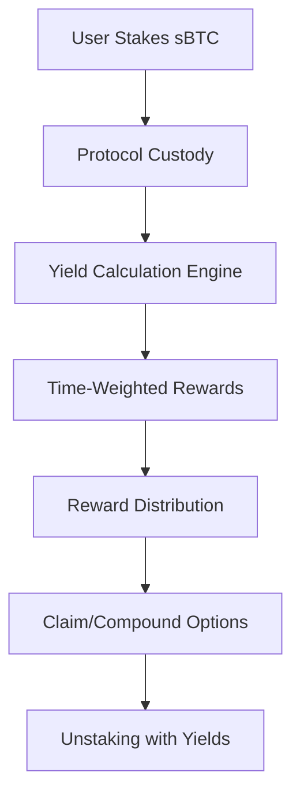

# YieldForge Protocol

[](https://opensource.org/licenses/ISC)
[](https://docs.stacks.co/clarity)
[](https://www.stacks.co/)
[](https://sbtc.tech/)

> **Advanced sBTC Liquidity Mining & Yield Optimization Platform**

YieldForge revolutionizes Bitcoin yield generation through sophisticated liquidity mining mechanics, delivering sustainable returns while maintaining full custody and security of staked assets on Stacks Layer 2.

## 🚀 Overview

A next-generation DeFi protocol engineered for Bitcoin holders seeking institutional-grade yield opportunities. YieldForge combines time-weighted reward algorithms with dynamic APY adjustments to create a self-balancing ecosystem that rewards long-term commitment while ensuring liquidity flexibility.

### Key Features

- 🔄 **Algorithmic Reward Distribution** - Time-weighted rewards with compounding capabilities
- 📊 **Dynamic Liquidity Incentives** - APY adjustments based on market conditions
- 🔒 **Institutional Security** - Multi-signature governance with robust access controls  
- ⛽ **Gas Optimization** - Cost-effective yield harvesting operations
- 🌐 **Cross-Protocol Integration** - Yield aggregation and optimization strategies
- 🏗️ **Built for Bitcoin DeFi** - Native Stacks blockchain infrastructure

## 📋 Table of Contents

- [Architecture](#architecture)
- [Smart Contract Functions](#smart-contract-functions)
- [Installation](#installation)
- [Usage](#usage)
- [Testing](#testing)
- [Deployment](#deployment)
- [Security](#security)
- [Contributing](#contributing)
- [License](#license)

## 🏗️ Architecture

YieldForge operates as a sophisticated yield farming protocol built on Stacks blockchain, utilizing sBTC as the primary asset for yield generation.

### Core Components

1. **Staking Engine** - Secure asset custody and position management
2. **Yield Calculator** - Time-weighted reward distribution algorithm
3. **Treasury Management** - Automated reward pool capitalization
4. **Governance Layer** - Protocol parameter management and upgrades

### Protocol Mechanics



## 📜 Smart Contract Functions

### Core Yield Functions

#### `stake(amount: uint)`

Deploy capital for yield generation and liquidity mining.

- **Parameters**: `amount` - sBTC amount to stake
- **Returns**: `(response bool uint)`
- **Requirements**: Amount > 0, sufficient sBTC balance

#### `unstake(amount: uint)`

Exit liquidity position with accumulated yield harvest.

- **Parameters**: `amount` - sBTC amount to unstake
- **Returns**: `(response bool uint)`
- **Requirements**: Minimum stake period elapsed, sufficient staked amount

#### `claim-rewards()`

Harvest accumulated yields without reducing position.

- **Returns**: `(response bool uint)`
- **Requirements**: Active stake, available rewards in pool

### Governance Functions

#### `set-reward-rate(new-rate: uint)`

Adjust protocol yield parameters (governance only).

- **Parameters**: `new-rate` - New reward rate in basis points
- **Access**: Contract owner only
- **Limits**: Maximum 1000 basis points (10% APY)

#### `set-min-stake-period(new-period: uint)`

Configure minimum liquidity commitment period.

- **Parameters**: `new-period` - Minimum blocks before unstaking allowed
- **Access**: Contract owner only

#### `add-to-reward-pool(amount: uint)`

Capitalize reward treasury for sustainable yield distribution.

- **Parameters**: `amount` - sBTC amount to add to reward pool
- **Access**: Anyone can contribute to reward pool

### Analytics Functions

#### `calculate-rewards(staker: principal)`

Advanced yield calculation with time-weighted rewards.

- **Parameters**: `staker` - Principal address of staker
- **Returns**: `uint` - Calculated reward amount

#### `get-protocol-stats()`

Comprehensive protocol performance dashboard.

- **Returns**: Protocol statistics including TVL, APY, reward pool status

## 🛠️ Installation

### Prerequisites

- [Clarinet CLI](https://docs.hiro.so/stacks/clarinet) v2.0+
- [Node.js](https://nodejs.org/) v18+
- [Stacks Wallet](https://wallet.hiro.so/) or compatible

### Setup

1. **Clone the repository**

   ```bash
   git clone https://github.com/irene-samuel/yield-forge.git
   cd yield-forge
   ```

2. **Install dependencies**

   ```bash
   npm install
   ```

3. **Verify installation**

   ```bash
   clarinet check
   ```

## 🎯 Usage

### Local Development

1. **Start Clarinet Console**

   ```bash
   clarinet console
   ```

2. **Deploy contracts**

   ```clarity
   (contract-call? .yield-forge stake u1000000) ;; Stake 1 sBTC
   ```

3. **Check stake information**

   ```clarity
   (contract-call? .yield-forge get-stake-info tx-sender)
   ```

### Staking Workflow

```typescript
// Example staking interaction
import { Cl } from "@stacks/transactions";

// Stake 1 sBTC (1,000,000 satoshis)
const stakeCall = Cl.callPublic("yield-forge", "stake", [
  Cl.uint(1000000)
]);

// Calculate current rewards
const rewardsCall = Cl.callReadOnly("yield-forge", "calculate-rewards", [
  Cl.principal("ST1PQHQKV0RJXZFY1DGX8MNSNYVE3VGZJSRTPGZGM")
]);

// Claim accumulated rewards
const claimCall = Cl.callPublic("yield-forge", "claim-rewards", []);
```

## 🧪 Testing

YieldForge includes comprehensive test coverage for all protocol functions.

### Run Tests

```bash
# Run all tests
npm test

# Run tests with coverage report
npm run test:report

# Watch mode for development
npm run test:watch
```

### Test Coverage

- ✅ Staking mechanics
- ✅ Reward calculations  
- ✅ Governance functions
- ✅ Security validations
- ✅ Edge case handling

### Example Test

```typescript
describe("YieldForge Protocol", () => {
  it("should allow users to stake sBTC", () => {
    const { result } = simnet.callPublicFn(
      "yield-forge",
      "stake",
      [Cl.uint(1000000)],
      address1
    );
    expect(result).toBeOk(Cl.bool(true));
  });
});
```

## 🚀 Deployment

### Testnet Deployment

1. **Configure network settings**

   ```bash
   clarinet deployments generate --testnet
   ```

2. **Deploy to testnet**

   ```bash
   clarinet deployments apply -p deployments/testnet.yaml
   ```

### Mainnet Deployment

1. **Security audit completed** ✅
2. **Configure mainnet deployment**

   ```bash
   clarinet deployments generate --mainnet
   ```

3. **Deploy to mainnet**

   ```bash
   clarinet deployments apply -p deployments/mainnet.yaml
   ```

## 🔒 Security

### Security Features

- **Access Controls** - Multi-level authorization system
- **Input Validation** - Comprehensive parameter checking  
- **Overflow Protection** - Safe arithmetic operations
- **Reentrancy Guards** - Protection against recursive calls
- **Time Locks** - Minimum stake period enforcement

### Error Codes

| Code | Constant | Description |
|------|----------|-------------|
| 100 | `ERR_NOT_AUTHORIZED` | Insufficient permissions |
| 101 | `ERR_ZERO_STAKE` | Invalid zero amount |
| 102 | `ERR_NO_STAKE_FOUND` | No active stake position |
| 103 | `ERR_TOO_EARLY_TO_UNSTAKE` | Minimum period not met |
| 104 | `ERR_INVALID_REWARD_RATE` | Rate exceeds maximum |
| 105 | `ERR_NOT_ENOUGH_REWARDS` | Insufficient reward pool |
| 106 | `ERR_INVALID_PERIOD` | Invalid time period |
| 107 | `ERR_SAME_OWNER` | Duplicate owner assignment |

### Audit Status

- [ ] **Internal Security Review** - In Progress
- [ ] **External Audit** - Pending
- [ ] **Formal Verification** - Planned

## 📊 Protocol Parameters

| Parameter | Default Value | Description |
|-----------|---------------|-------------|
| Reward Rate | 5 basis points | 0.05% base APY |
| Min Stake Period | 1440 blocks | ~10 days lockup |
| Max Reward Rate | 1000 basis points | 10% maximum APY |
| Initial Reward Pool | 0 sBTC | Treasury starts empty |

## 🤝 Contributing

We welcome contributions from the community! Please see our [Contributing Guidelines](CONTRIBUTING.md) for details.

### Development Process

1. Fork the repository
2. Create a feature branch
3. Make your changes
4. Add tests
5. Submit a pull request

### Code Standards

- Follow Clarity best practices
- Maintain comprehensive test coverage
- Update documentation for new features
- Use conventional commit messages

## 📄 License

This project is licensed under the ISC License - see the [LICENSE](LICENSE) file for details.

## 🔗 Links

- [Stacks Blockchain](https://www.stacks.co/)
- [Clarity Language](https://docs.stacks.co/clarity)
- [Clarinet SDK](https://docs.hiro.so/stacks/clarinet-js-sdk)
